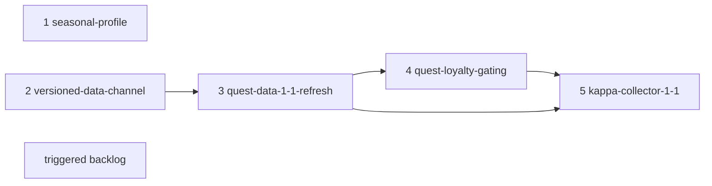

# EFT 1.1 Adaptation Roadmap — Technical Spec

- **Created**: 2026-08-08

> The sibling `feature-eft-1-1-roadmap.md` holds the product decision. Write
> this on the work's branch and merge it in the same PR as the work. Nothing is
> kept current: fields are written once, discoveries are appended. A later
> change that reverses a decision here appends `Superseded by <doc>` below this
> line, in the PR that reverses it. This spec records program-level decisions
> whose implementation is deliberately deferred to the phase PRs named below —
> nothing in it has shipped when it merges, and each phase documents its own
> design in its own spec.

> Superseded in part by `feature-quest-data-1-1-refresh.spec.md` (2026-08-21):
> the Technical Decision "Loyalty is a column on `Quests`, not a requirements
> table" and the phase-3 bullet's `MinTraderLevel` column are reversed. The 1.1
> data gates four ordinary quests on loyalty with a trader other than their
> giver, the case that decision named as its fallback trigger, so loyalty is
> published as a per-trader `QuestTraderRequirements` table; the phase-4
> bullet's column read becomes a read of that table, feature-detected by table
> existence. Also reversed: the phase-2 and phase-3 bullets' requirement that
> the channel reader be in the field before the first 1.1 publish. That publish
> stays additive under data format 1 and goes out from the merge the release is
> cut right after, minutes before the release that carries the reader. Every
> other decision here stands.

## Summary

Three ideas carry the whole program. First, the 1.1 quest data lands through
the existing TarkovDBEditor pipeline as an addition, not a rewrite — which
upstream source supplies the new semantics (the wiki's edited pages or
tarkov.dev's structured task data) is deliberately left open until the
quest-data phase starts, both candidates fill the same schema, and the result
reaches installs through a new version-aware data channel so that a shape an
older build cannot read never reaches it. Second, trader loyalty becomes a
first-class gate flowing DB → task model → availability engine → UI, reusing
the shape of every existing gate (level, reputation, edition). Third, the
seasonal character is a third profile ID on top of the existing profile-keyed
user-data design — no new storage architecture anywhere. This spec fixes the
cross-phase ground
rules and the dependency structure; each phase's detailed design belongs to that
phase's spec.

## Non-Goals

- No migration of quest or item primary keys off the wiki-URL-derived IDs;
  `BsgId` keeps carrying the external task ID.
- No rewrite of the wiki parsing layer under either source outcome — it stays
  in place at minimum for page identity; extensions only.
- No runtime icon or asset download channel in this program (deferred to its
  own document).
- No new `QuestStatus` enum member for loyalty locking (see Technical
  Decisions).

## Current Behavior

Symbol-anchored facts the phases build on, verified in this planning session.

- **Quest semantics come from wiki markup.** `WikiQuestService` regex-parses
  every gameplay field (`MinLevel`, `KappaRequired`, prerequisites, faction,
  editions, objectives); `TarkovDevDataService` supplies only task IDs,
  normalized names, KO/JA names, trader and item identity, and the hideout
  requirement tree. The `|previous` grammar is documented in
  `TarkovDBEditor/docs/QuestPreviousPatterns.md`. No loyalty requirement exists
  anywhere in the quest schema — `Quests` has no such column, and the only
  loyalty data in the app is the hideout display field
  (`HideoutTraderRequirement.Level`).
- **Availability engine.** `QuestProgressService.GetStatus` runs a fixed
  precedence chain (done/failed → edition → prestige → faction → DSP →
  prerequisites → level → scav karma → Active). Scav karma folds into
  `QuestStatus.LevelLocked` rather than owning a status — the precedent the
  loyalty gate follows. `ArePrerequisitesMet` evaluates `TaskRequirements`
  (GroupId 0 = AND, greater = OR groups) with `Previous` as fallback.
- **Collector is synthesized.** At DB build time,
  `RefreshDataService.AddCollectorKappaRequirementsAsync` builds Collector's
  prerequisites from every `KappaRequired = 1` quest; at runtime
  `QuestGraphService.GetCollectorProgress` and the kappa gauge read the flags.
- **Profiles.** `ProfileService` hardcodes the `pvp`/`pve` profile IDs. The
  gameplay stores (`QuestProgress`, `ObjectiveProgress`, `ItemInventory`,
  `HideoutProgress`, `ProfileSettings`) all carry `ProfileId` in their primary
  keys; `UserSettings` is deliberately global, and `RaidHistory` attributes
  rows through a nullable `ProfileId` column outside its primary key — raid
  history is exactly where the contamination lands, and its nullable legacy
  rows make "which profile owns this row" a real phase-1 question.
  `EftRaidEventService` detects the session mode from logs
  (`Session mode: (Pve|Pvp|Regular)`) and raises `SessionModeDetected`;
  `ProfileService` subscribes and performs the switch
  (`SetActiveGameMode(mode, isAuto: true)`), so the auto-switch — and phase
  1's suppression of it — lives in `ProfileService`. A Kord Breach session
  runs under PvP rules, so today it is detected as `Pvp` and written into the
  permanent PvP profile — the contamination path the first phase closes.
- **Log sync.** `LogSyncService` maps quest events by external task ID
  (`TarkovTask.Ids`); unknown IDs are dropped with only a count surfaced.
  `SettingsService.SyncDaysRange` exists, but `MainWindow.PerformQuestSync`
  never passes it, so every sync reads all logs ever — pre-season logs
  included. Neither log parser has unit tests.
- **Data channel.** `DatabaseUpdateService` polls the GitHub raw URL every five
  minutes and hot-swaps `tarkov_data.db` only; icons and map assets ship inside
  app releases (`ImageCacheService.GetLocalItemIcon` returns null for missing
  files). `QuestDbService` already feature-detects optional columns via
  `ColumnExistsAsync`. The version check is an exact string comparison with no
  minimum-app-version concept: every publish reaches every existing install
  within minutes, and builds already in the field cannot be retro-gated.
- **Upstream state (2026-08-08).** Wiki: the 1.1 format is live since
  2026-08-04 — `Obtain level N loyalty with [[Trader]]` requirement lines,
  story chains keep `|previous` while freed quests have it empty, `|reqkappa`
  updated, and a new "Operational Tasks" section with daily/weekly listings;
  pages are admin-protected until 2026-08-15. tarkov.dev GraphQL: unavailable
  since roughly 2026-07-29 (open outage issue upstream; every live probe during
  planning failed).

## Design

The program is five implementation phases plus a triggered backlog. Phase
numbering is dependency order: phases 1 and 2 are independent of each other and
both ready now (phase 1 ships first for the product reasons in the roadmap
PRD), and phases 3 through 5 chain behind phase 2.

### Phase plan

1. **seasonal-profile** — ready now, no upstream dependency. Adds the seasonal
   profile to `ProfileService` with a manual switcher; extends the reset
   action — today it clears only quest and hideout progress — to also clear
   item inventory, the profile's `ProfileSettings` rows, and
   profile-attributed `RaidHistory` rows (the roadmap PRD's R4 scope); wires
   the existing `SyncDaysRange` setting through `MainWindow.PerformQuestSync`
   so a season start stops ingesting pre-season logs; and lands the first
   fixture-based unit tests for `LogSyncService` and `EftRaidEventService` as
   the safety net for any parser change. Whether a seasonal session is
   distinguishable in the logs is this phase's open question, settled by
   capturing logs from a real Kord Breach session. If it is, the auto-switch
   learns it; if not, the phase must at minimum stop the PvP auto-switch from
   silently overriding a manually selected seasonal profile.
2. **versioned-data-channel** — ready now; app and publish-flow work with no
   upstream dependency. Gives each app build a data endpoint it is guaranteed
   to understand, and leaves builds that predate the mechanism on their
   current endpoint, which from then on only ever receives data compatible
   with them — frozen at its last compatible version when a publish cannot
   stay additive (stale but working; the roadmap PRD's R9 and R10). The
   mechanism itself — versioned URLs, a minimum-app-version marker, or a
   manifest — and the `DataPublishService`/`DatabaseUpdateService` changes it
   implies are this phase's design questions, deliberately not settled here.
   Its reader side must be in the field before or with the first 1.1 data
   publish; the app release the quest-data phase already cuts is the natural
   vehicle.
3. **quest-data-1-1-refresh** — TarkovDBEditor work; can start as soon as one
   candidate source is usable (the wiki already is), and its publish
   additionally requires phase 2's channel in the field. Opens by settling the
   data-source question (see Technical Decisions) and recording the choice in
   its own docs. The source-independent core: a `MinTraderLevel` column on
   `Quests` (additive-preferred, per the ground rules), registered in
   `_schema_meta` per the TarkovDBEditor schema checklist; a full
   regeneration; and a hand review of the diff with named spot checks
   (Stirrup's ten-kill Factory-only objective, the shrunken kappa set,
   Collector's synthesized requirements, survival of A Shooter Born in Heaven
   and Sew It Good - Part 4). Publishes the DB through the channel together
   with an app release carrying the refreshed icon pack. Whichever source is
   chosen, the pieces only tarkov.dev supplies — external IDs and KO/JA names
   for new content, hideout requirement updates — land when its API is
   reachable, inside the phase or as a follow-up re-run.
4. **quest-loyalty-gating** — depends on phase 3's data. The app side of
   loyalty: `QuestDbService` reads the new column behind `ColumnExistsAsync`;
   the profile drawer gains per-trader loyalty inputs (profile-scoped
   settings; the trader roster and each trader's maximum level are this
   phase's decisions — no per-trader max-level catalog exists in the schema
   today, so the clamp bound is new data the phase must source); `GetStatus`
   gains the loyalty gate folded into `LevelLocked`; quest rows badge
   "LL2"-style requirements the way they badge "Lv. 15" today; the chip
   vocabulary is untouched. This phase also audits the hardcoded caps
   (player level 79, prestige 5, scav rep ±6.0, edition strings) against 1.1
   and bumps what moved.
5. **kappa-collector-1-1** — depends on phases 3 and 4. Extends the Collector
   treatment to the 1.1 conditions — loyalty level 4 across traders, plus the
   Fence reputation threshold (the latter representable with the existing
   `RequiredScavKarma` field) — re-verifies CollectorPage and the kappa gauge
   against the shrunken set, and adjusts any user-facing Kappa wording the
   rework invalidates.
6. **Triggered backlog** — items that activate on an external event, each
   earning its own document when triggered: the runtime icon-download fallback
   (trigger: the next patch shipping new items, or the release-coupled publish
   proving painful); the side-task flag and filter (trigger: upstream data
   exposing the story/side distinction); consolidating the duplicate map-name
   tables (trigger: the next map addition) — two live copies in
   `LogSyncService` and `EftRaidEventService`, plus a third in
   `LogMapWatcherService`, which has no live callers today, so that cleanup
   should consider deleting the dead service outright rather than
   consolidating a copy nothing reads. If the quest-data phase picks one
   source and the other later proves clearly superior, revisiting that choice
   re-enters here as its own triggered item.

### Cross-phase ground rules

- **Additive-preferred schema; breaking changes only through the channel.**
  Until the versioned channel is in the field, every install polls one
  endpoint, so schema changes stay strictly additive — new columns or tables,
  feature-detected on read (the `ColumnExistsAsync` pattern), nothing renamed
  or repurposed — and a publish that needs new app code ships after or
  together with that app release, never before. Once the channel exists,
  additive remains the default because it keeps even pre-channel builds
  updatable; a publish that cannot stay additive is then allowed, and the
  pre-channel endpoint freezes at its last compatible version. In every case
  the roadmap PRD's R9 is the floor — crash-free, malfunction-free legacy
  builds — verified, not assumed: before any publish, the previous released
  build runs against the data its endpoint will actually serve, and any
  failure blocks the publish (see Test Strategy). Each phase's publish review
  also covers the legacy view — what the served data means in a build without
  that phase's code (for the 1.1 refresh, if it stays additive: dissolved
  chains render as immediate availability; functional, over-permissive,
  accepted in the roadmap PRD's Risks).
- **Phase docs own their detail.** This spec deliberately stops at the
  boundary: file-level designs, test matrices, and the decisions each phase
  discovers belong to that phase's spec, added on its branch and referencing
  this roadmap by filename.

## Technical Decisions

**Loyalty is a column on `Quests`, not a requirements table.** Every loyalty
requirement observed on ordinary 1.1 quest pages names the quest's own giving
trader — the quest unlocks when its trader reaches the level — so a single
`MinTraderLevel` column alongside `MinLevel` carries it, as the DB-to-app
contract either candidate source fills. A general cross-trader
requirements table (quest X needs trader Y at level N) was considered because
Collector genuinely has that shape (level 4 loyalty with every trader), but
Collector is already the pipeline's one synthesized special case, and building
the general table for one synthesized consumer is speculative generality. How
the synthesis represents Collector's cross-trader conditions — and whether the
availability engine gates on them or the Collector page displays them — is
phase 5's design question; if a future patch gates ordinary quests across
traders, the table is the recorded fallback.

**Loyalty locking folds into `LevelLocked` instead of a new status.** Scav
karma set the precedent: a gate that means "yours is not high enough yet"
reports `LevelLocked` and lets the row badge say which stat. The chip filter
work just pinned the status vocabulary with a literal oracle cross-checked
against the enum (`feature-quest-chip-only-status-filter.spec.md`), so a new
member is a deliberately breaking change to chips, counts, and persistence —
and it would buy nothing: the user-visible distinction lives in the badge
("LL2" vs "Lv. 15"), exactly as it already does for karma.

**The versioned data channel is a phase, not a trigger.** The earlier lean —
park it in the backlog until the first publish that cannot stay additive — was
reversed on the observation that the mechanism only protects builds shipped
after it exists: by the time the trigger fires, it is exactly too late for
every install in the field. The 1.1 rework is plausible as that first case,
and the quest-data phase already cuts an app release the channel's reader side
can ride, so the marginal cost of building it now is small. The channel's
policy is fixed here — the pre-channel endpoint only ever receives data
compatible with the builds that poll it, and freezes at its last compatible
version otherwise — while the mechanism (versioned URLs, a minimum-app-version
marker, or a manifest) is left to the phase docs.

**One rolling seasonal profile ID.** The per-season alternative was rejected in
the roadmap PRD for product reasons; technically it would also leak into every
profile enumeration (settings scoping, migration, sync) forever. Rolling reuse
means "season reset" is data deletion inside one profile, which the existing
reset action already models.

**The data-source choice is deferred to the quest-data phase.** Recording a
source commitment now was rejected: both candidates are moving targets (the
wiki is live with the 1.1 format but still settling under page protection;
tarkov.dev is down, with unknown recovery timing and unknown 1.1 task
coverage), and a decision made against today's snapshot could be wrong by the
time the phase starts. The phase opens with the decision, judged on three
things as of that date: which source is reachable, which carries complete 1.1
data including the loyalty requirements, and what the extraction costs. The
candidate shapes, deliberately left at one line each: the wiki path extends
`WikiQuestService`'s requirement grammar with the new loyalty line; the
tarkov.dev path requests the structured task fields the pipeline's existing
queries omit. Deeper design of either path belongs to the phase spec, written
once the choice is real.

## Open Questions

- Which upstream source supplies the 1.1 quest semantics — the wiki's edited
  pages or tarkov.dev's structured task data? Settled at the start of the
  quest-data phase against the upstream state then; both stay candidates until
  that decision is recorded in the phase's own docs.
- Does a Kord Breach session leave a distinguishable signature in the client
  logs (session mode value, server address, profile ID)? Settled in the
  seasonal-profile phase by capturing logs from a real seasonal session.
- When does tarkov.dev recover, and does it then carry 1.1 task data including
  loyalty requirements? Settled by re-probing; feeds the source decision and
  unblocks the pieces only tarkov.dev supplies (IDs, translations, hideout
  data).
- Does the 1.1 refresh stay additive, or does its final shape require a
  breaking change? Settled by the quest-data phase's source decision and diff;
  decides whether the pre-channel endpoint receives the 1.1 data or freezes at
  the pre-1.1 version.
- Did 1.1 move the level cap, prestige count, or reputation bounds? Settled by
  the phase-4 audit.
- Do teammate-credited (group progression) completions arrive as ordinary
  push-notification completion events? Settled by observation during seasonal
  play; confirms or reopens the group-progression Non-Goal.
- How much of the early-parsed wiki data gets corrected after page protection
  lifts on 2026-08-15? Settled by a re-parse diff after that date; may warrant
  a second DB publish.

## Test Strategy

Program-level expectations; each phase spec turns these into concrete tests.

- **Unit**: phase 1 lands the first fixture-based tests for both log parsers
  (currently untested) and pins profile isolation of the reset action; phase 4
  adds a `GetStatus` loyalty matrix, checked fail-first against the pre-gate
  engine; phase 5 pins the Collector synthesis output against the 1.1 set.
- **E2E**: phase 1 — progress written under the seasonal profile is invisible
  under PvP and vice versa; phase 2 — a build without the channel keeps
  updating and functioning against the restructured repository while the new
  build fetches from its own endpoint; phase 4 — editing a trader's loyalty in
  the drawer changes chip counts and a known quest's badge; phase 5 — the
  kappa gauge total equals the 1.1 requirement count against the real DB.
- **Data review (not automated)**: phase 3's regeneration diff is reviewed by
  hand against the named spot checks — it is data, not code, so the review is
  the test.
- **Legacy smoke (every publishing phase)**: before a publish, the previously
  released app build runs against the data its endpoint will actually serve —
  launch, the quest, hideout, and item pages load, and a log sync completes —
  with no crash or error state. Any failure blocks the publish. This enforces
  the roadmap PRD's R9 for builds that predate the channel.

## Verification

For this document PR:

- `dotnet test TarkovHelper.Tests --filter "FullyQualifiedName~PrdDocsTests"` —
  the pair passes the format invariants (no kept-current fields, sibling
  pairing, every referenced doc path resolves).
- `dotnet build TarkovHelper.sln` and `dotnet test --filter "Category!=E2E"` —
  clean build, full non-E2E suite green (the path-resolution test is
  repo-wide).

Each phase PR carries its own Verification section; the checks above run in
every one of them via the same suite.

## Risks & Migration

- **DB/app publish ordering.** A publish reaches polling installs within
  minutes, before anyone updates the app. Mitigated by the additive-preferred
  ground rule, feature-detected reads, and — once phase 2 lands — the
  versioned channel; the phase-3 publish is additionally coupled to an app
  release for the icon pack, which closes the skew window for installs that
  update. Installs that never update keep the legacy view permanently —
  functional by the ground rules, assessed per publish, accepted in the
  roadmap PRD's Risks.
- **Wiki page renames under 1.1 churn.** Quest and item primary keys derive
  from wiki page URLs, so a rename silently mints a new identity. Quest
  progress is dual-keyed (ID or normalized name), which absorbs most renames;
  item inventory is keyed by normalized name only. The phase-3 diff review
  explicitly looks for identity churn, and any loss found there gets its own
  decision — this program does not migrate the PK scheme (Non-Goals).
- **Rollback.** Phases are independent PRs and each records its own rollback.
  The DB side rolls back by re-publishing the previous database version (the
  updater follows any version-string change); the app side rolls back by
  releasing the prior build — both mechanisms exist today.
