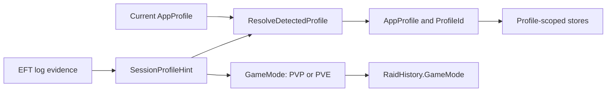
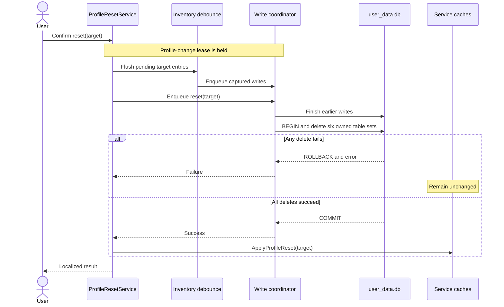
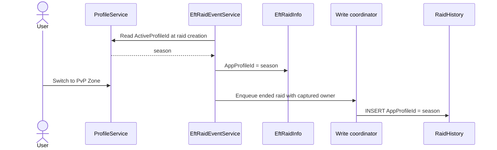

# Seasonal Profile - Technical Spec

- **Created**: 2026-08-08

> The sibling `feature-seasonal-profile.md` holds the product decision. Write this
> on the work's branch and merge it in the same PR as the work. Nothing is kept
> current: fields are written once, discoveries are appended. A later change that
> reverses a decision here appends `Superseded by <doc>` below this line, in the PR
> that reverses it.

## Summary

The app gains an `AppProfile` identity with `PvpZone`, `PveZone`, and
`PvpSeason`, separate from `GameMode`, which continues to describe PvP/PvE game
rules. Log evidence is represented by a third type, `SessionProfileHint`, so a
seasonal signature can be expressed without inventing a game mode the log did not
report. A pure resolver applies automatic detections and makes the seasonal pinning
rule directly testable.

Profile ownership is captured when each mutation or raid starts, never later inside
an asynchronous continuation. One ordered write coordinator makes those writes and
reset commands deterministic. Reset becomes one SQLite transaction across
all profile-owned tables, followed by cache replacement only after commit. Raid history
gets a nullable app-profile column, and bounded quest sync passes its cutoff into the
directory parser so old log files are not opened merely to discard their events.

## Non-Goals

- No raid-history UI. This phase attributes rows so reset can scope its delete;
  displaying them stays out of scope.
- No new storage architecture. The seasonal profile is a third `ProfileId` value in
  the existing profile-keyed tables.
- No per-season archive or user-created profile. The new profile is the one rolling
  seasonal container decided in `feature-eft-1-1-roadmap.md`.
- No change to how quest log events map to tasks. Only file/event eligibility and
  profile ownership change.
- No migration of an existing row to the seasonal profile. Pre-existing data stays
  where it is.
- No season-aware quest, hideout, or item content. Those are later roadmap phases.

## Current Behavior / Root Cause

Verified against the working tree before implementation.

- **The app profile is a projection of `GameMode`.**
  `ProfileService.ActiveProfileId` is `_activeGameMode == GameMode.PVE ? "pve" :
  "pvp"`, and `GameMode` has only `Unknown`, `PVP`, and `PVE`. The active value is
  stored globally as `app.activeGameMode = PVE|PVP`; initialization treats every
  unrecognized value as PvP.
- **The auto-switch consumes only PvP/PvE.**
  `EftRaidEventService.ParseApplicationLogLine` matches
  `Session mode: (Pve|Pvp|Regular)`. `ProfileService.OnRaidEvent` reads
  `CurrentGameMode` and calls `SetActiveGameMode(mode, isAuto: true)`. The startup
  scan raises the same event from the last session line, so a Kord Breach session
  currently lands in PvP at launch as well as during live monitoring.
- **The table schemas are profile-scoped, but not every asynchronous write is.**
  `QuestProgress`, `ObjectiveProgress`, `ItemInventory`, `HideoutProgress`, and
  `ProfileSettings` include `ProfileId` in their keys. However, several quest and
  objective entry points start untracked work and read
  `ProfileService.ActiveProfileId` inside that later work. A switch between mutation
  and execution can redirect the write. Inventory already captures the profile in
  `_pendingSaves`, but its debounce buffer can outlive a reset.
- **Profile reloads can complete out of order.** The four profile-aware services
  subscribe to `ActiveProfileChanged` and start asynchronous reloads that consult
  the global active profile. A slow earlier reload can apply after a newer switch.
- **`RaidHistory.ProfileId` is the EFT character id, not the app profile.** It is
  populated from `EftRaidInfo.ProfileId`, the 24-hex PMC or SCAV id parsed from
  `TRACE-NetworkGameCreate` or fallback `SelectProfile` paths. `GameMode` is the
  only mode-like raid column, so no row records whether the app profile was PvP Zone,
  PvE Zone, or PvP Season. This corrects the interpretation in
  `feature-eft-1-1-roadmap.spec.md`; its phase-1 scope remains unchanged.
- **Raid saves are queued without ownership.** Raid-end paths wrap
  `SaveRaidHistoryAsync(_currentRaid)` in `Task.Run`. Reading the active app profile
  in the database method would therefore attribute the row at task execution, not
  when the raid happened.
- **Nothing reads raid history today.** `GetRaidHistoryAsync`,
  `GetRaidStatisticsAsync`, and `CleanupRaidHistoryAsync` have no external callers.
- **Reset clears only quest/objective and hideout data.** The button does not call
  `ItemInventoryService.ResetAllInventory`, and nothing clears `ProfileSettings` or
  `RaidHistory`. Existing reset methods perform independent deletes, swallow
  database exceptions, and update memory before durable success. Pending inventory,
  quest, or raid writes can run after a delete and recreate rows.
- **The sync range is collected and dropped by the UI path.**
  `SettingsService.SyncDaysRange` persists to `app.syncDaysRange`, and
  `SyncFromLogsAsync` accepts `daysRange`, but `MainWindow.PerformQuestSync` omits it
  and gets the default `0` (all history). Even when a caller supplies a bound, the
  service parses every push-notifications file and filters events afterwards.
- **Profile settings are already enumerated.** `SettingsService.ProfileSpecificKeys`
  contains level, scav reputation, level-lock visibility, DSP count, faction,
  editions, and prestige. Other settings remain global in `UserSettings`.
- **The switcher is a two-button toggle.** `MainWindow.xaml` has literal `PvP` and
  `PvE` contents, localized tooltips, and an Auto badge.
- **The database singletons are not unit-test isolated by an environment change.**
  `UserDataDbService` captures `AppEnv.ConfigPath` in its private singleton
  constructor. `TARKOVHELPER_CONFIG_PATH` correctly isolates a child app process in
  E2E tests, but changing it per unit-test class cannot recreate an already-built
  `Lazy<T>` singleton.

## Design

### Profile identity and detected-session hints

`Models/AppProfile.cs` introduces the app-level choice:

```
AppProfile.PvpZone
AppProfile.PveZone
AppProfile.PvpSeason
```

`Models/EftRaidEvent.cs` keeps `GameMode.Unknown`, `GameMode.PVP`, and
`GameMode.PVE` unchanged and adds the parsed session classification:

```
SessionProfileHint.Unknown
SessionProfileHint.PvpZone
SessionProfileHint.PveZone
SessionProfileHint.PvpSeason
```

The existing tokens map `Pve` to `PveZone` and `Pvp`/`Regular` to `PvpZone`. If the
real seasonal log capture identifies a stable signature, that evidence maps to
`PvpSeason`. Both PvP hints imply `GameMode.PVP` for raid rules and persistence;
the hint answers which app profile the session belongs to, not how the game plays.

The type split keeps log evidence, storage selection, and game rules from being
collapsed into one enum:



`ProfileService` changes as follows:

- `SeasonProfileId = "season"` joins `PvpProfileId` and `PveProfileId`.
- `ActiveProfile` replaces `_activeGameMode` as stored state. `ActiveProfileId` maps
  the enum to its string id. `ActiveGameMode` remains computed: both PvP profiles
  report `GameMode.PVP`.
- `ProfileChangedEventArgs` carries `AppProfile Profile`, `string ProfileId`, the
  computed `GameMode`, `IsAutoDetected`, and a monotonic `Revision`.
- `SetActiveProfile(AppProfile profile, bool isAuto = false)` is the manual/state
  mutator. Main-window buttons and the Debug Toolbox call it directly.
- `ApplyDetectedProfile(SessionProfileHint hint)` is the log-facing adapter. Both
  live detection and the startup scan use it.
- `GetProfileId(AppProfile)` is added. The `GameMode` overload remains only for
  legacy JSON/config migration, where PvP deliberately means the permanent `pvp`
  profile.
- The existing key `app.activeGameMode` stores `PVP`, `PVE`, or `SEASON`.
  `ParsePersistedProfile` and `SerializeProfile` are pure helpers; an unknown value
  falls back to `PvpZone`, matching old-build behavior.

The pure resolution function is:

```
ProfileResolution ResolveDetectedProfile(
    AppProfile current,
    SessionProfileHint detected)
```

`ProfileResolution` contains `Profile` and `DetectionApplied`.

- `Unknown` returns the current profile with `DetectionApplied = false`.
- While current is `PvpSeason`, `PvpZone` and `PveZone` hints are suppressed and
  return seasonal with `DetectionApplied = false`.
- A `PvpSeason` hint is applied normally, including from a permanent profile.
- From either permanent profile, recognized permanent hints map as they do today.

A suppressed hint does not change `IsAutoDetected`, persist a value, raise
`ActiveProfileChanged`, or show the Auto badge. A genuine seasonal hint may mark an
already-selected seasonal profile as auto-detected because the log then confirmed
the selection.

Writes to `app.activeGameMode` are serialized. Each queued persistence operation
reads the current enum only after entering the serializer, so rapid switches cannot
finish out of order and leave an older selection stored for the next launch.

### Mutation ownership, write ordering, and reload ordering

Every profile-scoped mutation captures `AppProfile` and `ProfileId` synchronously,
before any task, timer, event dispatch, or database await. The captured id travels
with the command. An asynchronous persistence helper must not consult
`ProfileService.ActiveProfileId` to decide where an existing mutation belongs.

A new `ProfileDataWriteCoordinator` owns one ordered asynchronous queue for all
profile-scoped writes. Quest, objective, hideout, inventory, profile-setting,
attributed raid-history, and reset writes enter that queue when the app accepts the
operation. The single queue matches SQLite's single-writer behavior, prevents
cross-profile connection lock races, and gives reset a total order. A failed entry is
observed and logged but does not poison the queue tail; reset failures are returned to
their awaiting caller.

Service changes:

- `QuestProgressService` passes captured ids into every batch, single quest,
  objective save, and delete helper. Fire-and-forget UI entry points enqueue
  immediately instead of starting an untracked `Task.Run`.
- `ItemInventoryService` retains dirty-time ownership. Flushing its debounce buffer
  moves the captured entries into the coordinator while holding `_lock`, then clears
  the buffer before releasing the lock.
- `HideoutProgressService` and `SettingsService` use explicit ids even where the
  current path happens to block synchronously.
- Raid-end handling enqueues immediately and no longer wraps the enqueue in
  `Task.Run`.

`ProfileService` increments `Revision` for every applied state change. Profile-change
handlers capture the event revision and target, obtain data into local temporary
state, then apply it only if both still match the service's current state. The
revision check covers rapid round trips such as PvP Zone -> PvP Season -> PvP Zone,
where target equality alone cannot distinguish the stale first PvP reload from the
newest one.

### Atomic profile reset

`ProfileResetService.ResetAsync(AppProfile target)` owns the entire reset. The
main-window handler captures the target and localized label before confirmation, so
the dialog and operation refer to the same profile.

The sequence is:

1. If the target has a raid in `Matching`, `Connecting`, or `InRaid`, refuse the
   reset with a localized message. This avoids assigning a raid that spans the reset
   boundary to either side by accident.
2. After confirmation, acquire a profile-change lease from `ProfileService` and
   disable reset, profile-switching, and profile-editing controls. The lease defers
   both manual and automatic changes and prevents a second reset.
3. Stop the inventory debounce timer and move all pending target-profile entries
   into the ordered queue. Other write types were enqueued at mutation time.
4. Enqueue the reset behind those writes. `UserDataDbService.ResetProfileDataAsync`
   uses one connection and one SQLite transaction to delete the target from:
   `QuestProgress`, `ObjectiveProgress`, `HideoutProgress`, `ItemInventory`,
   `ProfileSettings`, and `RaidHistory WHERE AppProfileId = @profileId`.
5. Commit only after all six deletes succeed. Exceptions propagate to the UI; the
   transaction rolls back and the app shows a localized failure dialog.
6. After commit, call non-persisting `ApplyProfileReset(profileId)` methods that
   replace quest/objective, hideout, inventory, and profile-settings caches with
   their canonical empty/default state and raise their normal change events. Then
   show success and release the lease. The newest deferred detection is re-evaluated
   after release.

The coordinator places reset after every already-accepted write and before every
later write. Only a committed transaction changes the caches:



No cache is cleared before commit, and the post-commit cache path performs no I/O or
persistence that can partially reset the database. A rollback therefore leaves
durable and visible state intact. Writes accepted before reset are ordered before the
transaction and then deleted; writes accepted after it are ordered after it and
represent new data.
`UserSettings`, other profile ids, and unattributed raid rows are never included.

Resetting all `ProfileSettings` rows covers profile data added there by later phases,
including trader loyalty. A future profile-owned table must be added to the same
transaction and its reset isolation test.

### Raid attribution

`RaidHistory` gains `AppProfileId TEXT NULL` alongside the existing EFT-character
`ProfileId`. The fresh-database `CREATE TABLE` statement includes the column. For an
existing database, `CreateTablesAsync` runs a guarded `pragma_table_info` check after
the table exists and applies `ALTER TABLE RaidHistory ADD COLUMN AppProfileId TEXT`
only when needed. Existing rows remain `NULL`, which makes R7 true by construction.

`EftRaidInfo` gains `string? AppProfileId`. Each path that first creates a raid
(`TRACE-NetworkGameCreate`, scene-preset fallback, and transit fallback) copies
`ProfileService.ActiveProfileId` at that moment. Later switches cannot change the
owner. `SaveRaidHistoryAsync` writes `raid.AppProfileId`; it never reads current
profile state. History reads map the new column back onto the model.

The snapshot travels with the raid even when the user switches before the queued
save runs:



The coordinator orders an ended raid's save before a later reset. Reset deletes only
`WHERE AppProfileId = @profileId`, so `NULL` legacy rows and other profiles survive.
No new index is added: the table has no reader today, and the only new query is an
infrequent reset delete.

### Bounded log sync

`MainWindow.PerformQuestSync` passes `_settingsService.SyncDaysRange` into
`SyncFromLogsAsync`.

`LogSyncService` receives a `TimeProvider`; the production singleton uses
`TimeProvider.System`. One local `now` and cutoff are captured per sync and passed to
`ParseLogDirectoryAsync`.

For `daysRange > 0`:

1. Enumerate `*push-notifications*.log` metadata.
2. Skip files whose local `LastWriteTime` is older than the cutoff.
3. Parse only eligible files.
4. Retain only events whose embedded timestamp is `>= cutoff`.

The file timestamp is the I/O boundary; the embedded event timestamp is the import
boundary within an eligible file. For `daysRange == 0`, all files and events remain
eligible. Progress reports both eligible and total file counts, for example
`Scanning 3/42 log files from the last 7 days`, so manual verification can distinguish
file skipping from post-parse event filtering.

An internal constructor accepts a test `TimeProvider`. Boundary tests therefore use
the same fixed instant for file and event comparisons instead of racing separate
calls to `DateTime.Now`.

### UI and localization

`MainWindow.xaml` replaces `BtnPvP` and `BtnPvE` with `BtnPvpZone`, `BtnPveZone`,
and `BtnPvpSeason`, preserving `GameModeToggleStyle` and `TxtAutoIndicator`. Button
content moves into `ApplyLocalization`. `UpdateProfileUI(AppProfile, bool)` checks
exactly one button and displays Auto only for an applied detection.

Profile labels match the game client:

| Key | EN | KO | JA |
| --- | --- | --- | --- |
| `HeaderPvpZone` | PvP Zone | PvP 존 | PvP ゾーン |
| `HeaderPveZone` | PvE Zone | PvE 존 | PvE ゾーン |
| `HeaderPvpSeason` | PvP Season | 시즌 PvP | PvP シーズン |

Existing PvP/PvE tooltip keys retain their names with updated wording, and
`HeaderPvpSeasonTooltip` is added. Reset adds `ResetProfileTitle`,
`ResetProfileConfirmFormat`, `ResetProfileScopeList`, `ResetProfileDoneFormat`,
`ResetProfileFailedFormat`, and `ResetProfileInRaid`. The confirmation format names
the captured profile and lists quest/objective progress, hideout progress, item
inventory, profile settings, and attributed raid history. All keys have EN/KO/JA
values and join the localization key/format guard tests.

### Test seams

Unit tests do not change `TARKOVHELPER_CONFIG_PATH` in the shared test process.
`UserDataDbService` gains an internal constructor with an explicit database path;
`ProfileResetService`, `ProfileDataWriteCoordinator`, and `LogSyncService` gain
internal dependency-injection constructors. Production singleton creation stays
unchanged. The existing `<InternalsVisibleTo Include="TarkovHelper.Tests" />` item in
`TarkovHelper.csproj` exposes these seams.

Pure profile resolution and persistence helpers require neither a singleton nor a
database. Database integration tests create an independent object graph and file.
Only E2E tests use `TARKOVHELPER_CONFIG_PATH`, by setting it on the child app process
before launch.

### File list

- `TarkovHelper/Models/AppProfile.cs` (new)
- `TarkovHelper/Models/EftRaidEvent.cs` (`SessionProfileHint`, event payload,
  `EftRaidInfo.AppProfileId`)
- `TarkovHelper/Services/ProfileService.cs`
- `TarkovHelper/Services/ProfileDataWriteCoordinator.cs` (new)
- `TarkovHelper/Services/ProfileResetService.cs` (new)
- `TarkovHelper/Services/UserDataDbService.cs` (schema migration, raid mapping,
  transactional reset, explicit-path test constructor)
- `TarkovHelper/Services/QuestProgressService.cs`
- `TarkovHelper/Services/HideoutProgressService.cs`
- `TarkovHelper/Services/ItemInventoryService.cs`
- `TarkovHelper/Services/SettingsService.cs`
- `TarkovHelper/Services/EftRaidEventService.cs`
- `TarkovHelper/Services/LogSyncService.cs`
- `TarkovHelper/Services/LocalizationService.Header.cs`
- `TarkovHelper/MainWindow.xaml`, `TarkovHelper/MainWindow.xaml.cs`
- `TarkovHelper/Debug/TestMenu.cs`
- `TarkovHelper.Tests/ProfileSwitchingTests.cs` (new)
- `TarkovHelper.Tests/ProfileWriteOrderingTests.cs` (new)
- `TarkovHelper.Tests/ProfileResetTests.cs` (new, orchestration with fakes)
- `TarkovHelper.Tests/ProfileResetDatabaseTests.cs` (new)
- `TarkovHelper.Tests/RaidAttributionTests.cs` (new)
- `TarkovHelper.Tests/LogSyncRangeTests.cs` (new)
- `TarkovHelper.Tests/UserDataSchemaMigrationTests.cs` (new)
- `TarkovHelper.Tests/SeasonalProfileE2ETests.cs` (new)
- `TarkovHelper.Tests/LocalizationHeaderStringsTests.cs`

## Technical Decisions

**App profile, session hint, and game mode are three concepts.** `AppProfile` is the
user-visible storage selection. `SessionProfileHint` is what the parser can infer
about that selection. `GameMode` is the PvP/PvE rules fact persisted on a raid.
Adding `Season` to `GameMode` was rejected because it would let the parser and raid
table hold a mode the existing log may never report; passing only `GameMode` to the
resolver was rejected because it cannot represent a discovered seasonal signature.

**Pinning is a resolver result, not a mutable flag.** A separate `_seasonPinned`
boolean could disagree with the active profile. `ResolveDetectedProfile` derives the
decision from its inputs and returns `DetectionApplied`, which also prevents a
suppressed hint from falsely turning on the Auto badge.

**Ownership is captured at mutation time.** Resolving the profile inside an async
save was smaller but incorrect: a manual or automatic switch can occur before the
continuation runs. Every command therefore carries an immutable target id.

**One ordered queue is the reset boundary.** Merely awaiting the current reset
methods does not cover debounced or already-scheduled writes. A queue per profile was
considered, but all profiles share one SQLite file and SQLite ultimately serializes
their commits; parallel queues would add lock contention without useful write
parallelism. One queue gives reset a simple total order and ordinary callers still do
not block the UI.

**Reset deletion is one database transaction.** Calling six existing service methods
would allow partial durable success, and those methods currently hide failures. One
transaction gives rollback a precise meaning. Service caches change only after
commit so memory never advertises a reset that the database rejected.

**Reset is unavailable during an active raid.** Allowing it would require a product
rule for whether a raid that starts before reset and ends afterwards belongs before
or after the boundary. Blocking is explicit, recoverable, and avoids silently
choosing either interpretation.

**`AppProfileId` is a new raid column.** Reusing `RaidHistory.ProfileId` would change
the meaning of stored EFT character ids and break downgrade compatibility. A nullable
additive column preserves every old row and represents unattributed history directly.

**Raid ownership is captured when the raid object is created.** Save-time ownership
can change and task scheduling is nondeterministic. Raid-start capture matches R4's
active-when-it-happened language and makes every construction path testable.

**The sync window remains global and enters file selection.** Making
`SyncDaysRange` profile-specific would add settings UI outside this PRD. Filtering
only after parsing prevents re-import but still violates the promise not to scan all
history, so the cutoff is applied to file eligibility and again to event timestamps.

**Tests construct dependencies rather than resetting singletons.** Per-test
environment mutation is process-global and ordering-dependent. Internal constructors
reuse production code while giving every database and clock test deterministic
ownership.

## Open Questions

- Does a Kord Breach session leave a stable signature in application logs, such as a
  new `Session mode:` token, a distinct server/address field, or another session
  marker? Settle this by capturing a real seasonal session and diffing it against a
  permanent PvP session. If it exists, map it to
  `SessionProfileHint.PvpSeason`; otherwise manual selection plus pinning is the
  shipped behavior. Append the outcome and a redacted fixture pattern here before
  merge.
- Does the seasonal character report a different PMC profile id? Check the
  `SelectProfile` and `TRACE-NetworkGameCreate` values in the same capture. If it
  changes, record whether `eft.pmcProfileId` and SCAV derivation remain valid across
  character switches and add the corresponding parser/profile test.

These are unresolved external facts, not missing type-system paths: the design can
represent either outcome. The phase is not verified until the observed result is
recorded and fixture-tested.

## Test Strategy

- **`ProfileSwitchingTests`**: matrix
  `ResolveDetectedProfile(AppProfile, SessionProfileHint)`, including Unknown,
  seasonal suppression in both directions, genuine seasonal detection, and
  `DetectionApplied`. Test pure parse/serialize round trips for `PVP`, `PVE`, and
  `SEASON`, plus unknown fallback.
- **`ProfileWriteOrderingTests`**: a quest/objective mutation immediately followed
  by a switch writes the captured original id; pre-reset writes finish before and
  are deleted by reset; post-reset writes survive; an inventory entry still in the
  debounce buffer cannot reappear after reset; a failed queue entry does not poison
  the next entry.
- **`ProfileResetTests`**: injected fakes prove lease acquisition/release, pending
  flush before reset, no cache change or success on failure, canonical cache reset
  after commit, and active-raid refusal.
- **`ProfileResetDatabaseTests`**: seed all six profile-owned tables for two profiles,
  one unattributed raid, and global settings. Reset one profile and assert exact
  isolation. A SQLite trigger that aborts one delete proves every earlier delete
  rolls back.
- **`RaidAttributionTests`**: create a raid under one profile, switch before ending,
  delay persistence, and assert the start owner is stored. Verify all three raid
  construction paths and that an ended raid queued before reset is removed.
- **`LogSyncRangeTests`**: fixed `TimeProvider`, old/eligible files, and
  old/boundary/new events. Assert old files are not scanned, exact-boundary events
  are included, old events in eligible files are excluded, and `0` scans all.
- **`UserDataSchemaMigrationTests`**: a fresh database has `AppProfileId`; upgrading
  the previous schema adds it once and preserves rows as `NULL`; initializing twice
  is a no-op.
- **`SeasonalProfileE2ETests`**: launch a child app with isolated config, verify three
  localized profile controls, seed or edit representative quest, hideout, inventory,
  collector, and drawer state under two profiles, and verify visible two-way
  isolation. Reset seasonal, verify its pages/defaults are empty, switch to PvP, and
  verify PvP plus global settings survived. Decline confirmation and verify no rows
  changed.
- **Parser fixture**: the real seasonal capture produces a fixture test whether its
  result is a positive signature or confirmed indistinguishability.
- **Not automated**: live game behavior and the private main-window sync wiring are
  manually verified below. Unit tests cover their pure/parser dependencies; a mock
  that only confirms a method argument would not prove the game or UI path.

Requirement coverage:

| Requirement | Evidence |
| --- | --- |
| R1 | localization guards plus profile-control/page E2E |
| R2 | captured-write ordering tests, reset DB isolation, and two-way E2E |
| R3 | resolver matrix, startup/live parser fixture, and manual live pin check |
| R4 | raid-start attribution and queue-order tests |
| R5 | transactional reset, rollback tests, and reset E2E |
| R6 | localized dialog guards, orchestration failure tests, and decline/success E2E |
| R7 | legacy-null migration and reset DB tests |
| R8 | file/event cutoff tests plus manual eligible-file progress check |
| R9 | schema migration tests and existing-profile E2E seed verification |

## Verification

- `dotnet build TarkovHelper.sln`: clean.
- `dotnet test TarkovHelper.Tests/TarkovHelper.Tests.csproj --filter
  "Category!=E2E"`: full non-E2E suite green, including ordering races, rollback,
  migration, parser, localization, and decision-doc invariants.
- `dotnet test TarkovHelper.Tests/TarkovHelper.Tests.csproj --filter
  "FullyQualifiedName~SeasonalProfileE2E"`: visible isolation, confirmation decline,
  complete reset, and preservation path green against a child-process app.
- Manual Debug build launched as
  `dotnet TarkovHelper/bin/Debug/net8.0-windows/TarkovHelper.dll`:
  - EN/KO/JA each show the three exact labels and localized reset text.
  - Starting the game while PvP Season is selected does not move the selection or
    turn on Auto for a suppressed permanent-profile hint.
  - Reset during Matching/Connecting/InRaid is refused; reset after the raid commits
    and leaves every active-profile page and drawer field at defaults.
  - With sync range set to a few days, progress reports fewer eligible files than the
    total and no older quest event is imported. Range `0` reports/scans all files.
  - The redacted seasonal and permanent log captures produce the documented
    `SessionProfileHint` result.

## Risks & Migration

- **Schema.** Fresh creation includes `AppProfileId`; existing databases receive one
  guarded additive column. Existing raid rows remain `NULL`, and no existing PvP/PvE
  row moves or changes value.
- **Downgrade.** An older build treats `app.activeGameMode = SEASON` as PvP and can
  write permanent PvP data while downgraded. Seasonal rows and the extra raid column
  remain inert and reappear after upgrading; no data is deleted by downgrade.
- **Write ordering.** Every profile-scoped persistence path must use the coordinator.
  A direct database write added later can bypass reset ordering, so the ordering tests
  and file-level review guard this invariant.
- **Reload ordering.** Profile changes remain responsive because reloads are async,
  but results apply only to their captured active target. The E2E switch path must
  wait for visible target data rather than use fixed delays.
- **File timestamps.** Bounded file selection assumes `LastWriteTime` is a usable
  upper bound for ordinary EFT-created logs. Copied files with a newer timestamp are
  safely parsed and filtered by embedded event time; manually backdated or corrupted
  metadata can skip a recent event. Range `0` remains the recovery path.
- **Startup detection.** The startup scan runs after saved-profile initialization and
  uses the same resolver as live events. Otherwise the last PvP-shaped line could
  pull a restored seasonal selection into permanent PvP before user interaction.
- **Live-raid reset.** Blocking is a new safety limitation. If product review wants a
  different boundary rule, append that decision to the sibling PRD before changing
  implementation.
- **Rollback.** Releasing the prior app build leaves the column and `season` rows
  unused. No asset-database publish or content migration is part of this phase.
