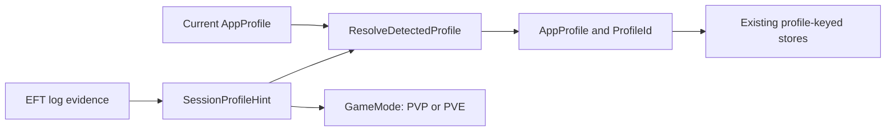
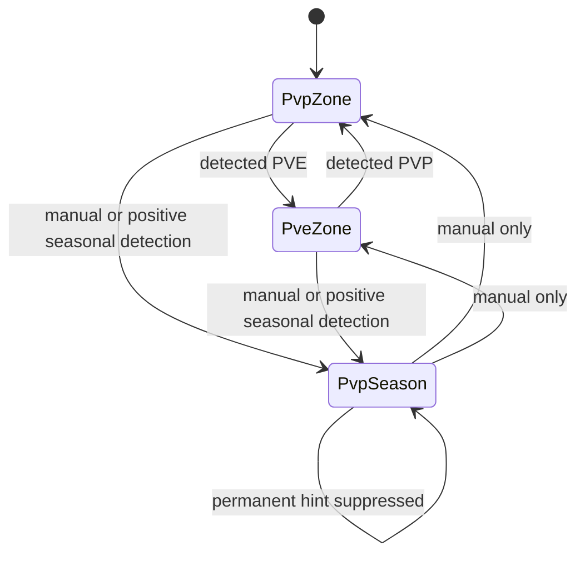

# Seasonal Profile - Technical Spec

- **Created**: 2026-08-08

> The sibling `feature-seasonal-profile.md` holds the product decision. Write this
> on the work's branch and merge it in the same PR as the work. Nothing is kept
> current: fields are written once, discoveries are appended. A later change that
> reverses a decision here appends `Superseded by <doc>` below this line, in the PR
> that reverses it.

## Summary

`ProfileService` gains an app-level `AppProfile` with `PvpZone`, `PveZone`, and
`PvpSeason`. `GameMode` remains the PvP/PvE rules fact. A separate
`SessionProfileHint` carries what logs can say about profile selection, including
the observed `PvpSeason` token, without putting an app-only value into `GameMode`.

The title bar becomes a three-way localized switcher. PvP Season is pinned against
ambiguous permanent-PvP and PvE auto-detections; manual selection of a permanent
profile restores current automatic behavior. Existing profile-keyed tables accept the
new `season` id without schema changes or row migration.

This spec is the technical design for profile identity, selection, and compatibility.
It does not change the existing partial, active-profile reset. A complete profile
reset and raid attribution require a separate product and technical decision under
SPA-3, SPA-4, and SPA-6. The supporting analysis and recommended follow-ups are
preserved in:

- `2026-08-seasonal-profile-amplified-issues.md` (problems made more
  important by seasonal-profile usage)
- `2026-08-seasonal-profile-adjacent-issues.md` (existing adjacent
  problems not materially worsened by it)

## Non-Goals

- No write coordinator, mutation-time ownership retrofit, or reload revision system
  (SPA-1 and SPA-2).
- No reset or raid-history implementation. Complete profile reset is a separate
  PRD/spec tracked by SPA-3, SPA-4, and SPA-6.
- No change to `SyncDaysRange`, log-file selection, or sync clocks (SPA-5, SPT-2,
  SPT-3).
- No general singleton/test-construction refactor (SPT-4).
- No latest-wins rewrite for the existing fire-and-forget active-profile setting
  write (SPT-1).
- No per-season archive, user-created profile, raid-history UI, or season-aware
  content.
- No migration of an existing PvP/PvE row to `season`.

## Current Behavior / Root Cause

Verified against the working tree before implementation.

- `ProfileService` stores one `_activeGameMode`; `ActiveProfileId` maps PVE to `pve`
  and everything else to `pvp`.
- The global `app.activeGameMode` setting stores `PVE` or `PVP`. Initialization maps
  every unknown value to PvP.
- `EftRaidEventService` recognizes `Session mode: (Pve|Pvp|Regular)` and raises
  `SessionModeDetected`. Because the expression has no token boundary,
  `Session mode: PvpSeason` currently matches the `Pvp` prefix and is misclassified
  as permanent PvP. `ProfileService.OnRaidEvent` calls
  `SetActiveGameMode(mode, isAuto: true)`. The startup scan raises the same event
  from the newest log's last session line.
- The profile parser recognizes only legacy `SelectProfile ProfileId:...` lines.
  EFT 1.1.0.0 emits `PrepareSelectedProfileLocally` followed by
  `CompleteSelectedProfile`, so current startup/live parsing does not refresh the
  PMC/SCAV identity after an in-game profile switch.
- `QuestProgress`, `ObjectiveProgress`, `HideoutProgress`, `ItemInventory`, and
  `ProfileSettings` are already keyed by string `ProfileId`. Their services reload
  after `ActiveProfileChanged`, so a new id does not require table migration.
- `MainWindow.xaml` has `BtnPvP` and `BtnPvE`, literal button contents, localized
  tooltips, and an Auto badge.
- The Debug Toolbox toggles through `SetActiveGameMode`, which would become the wrong
  path once automatic detection is pinned separately from manual selection.
- Async profile ownership, reload ordering, partial reset, unattributed raid history,
  and ignored sync range already exist. They are evidence in the two assessments,
  not root causes introduced by this feature.
- Reset Progress calls the quest and hideout reset services. Those delete quest,
  objective, and hideout rows with `WHERE ProfileId = ActiveProfileId`; inventory,
  profile settings, and raid history remain. The action is therefore profile-scoped
  already, but it is not a complete profile reset.

## Design

### Profile identity and log evidence

`Models/AppProfile.cs` introduces:

```
AppProfile.PvpZone
AppProfile.PveZone
AppProfile.PvpSeason
```

The id mapping is `pvp`, `pve`, and `season` respectively.

`Models/EftRaidEvent.cs` keeps `GameMode.Unknown`, `GameMode.PVP`, and
`GameMode.PVE` unchanged and adds:

```
SessionProfileHint.Unknown
SessionProfileHint.PvpZone
SessionProfileHint.PveZone
SessionProfileHint.PvpSeason
```

Known log tokens map `Pve` to `PveZone`, `Pvp`/`Regular` to `PvpZone`, and the
observed `PvpSeason` token to `PvpSeason`. Both PvP hints still imply
`GameMode.PVP` for raid/game-rule callers. The session-mode expression matches the
whole token (for example,
`Session mode:\s*(Pve|PvpSeason|Pvp|Regular)\s*$`) so `PvpSeason` cannot regress to
the old `Pvp` prefix match.

EFT 1.1 profile selection is a two-phase log sequence. The parser keeps legacy
`SelectProfile` support and treats `CompleteSelectedProfile` as the authoritative
new selection line. It does not publish from `PrepareSelectedProfileLocally`, which
can appear without a matching completion when a transition is interrupted. The
selected PMC id updates `EftProfileInfo` exactly as the legacy line did; it is not
used to infer an `AppProfile`.



This split is required because PvP Zone and PvP Season share PvP game rules but must
select different app storage ids.

### Profile service and pinning

`ProfileService` changes shape around `AppProfile`:

- `SeasonProfileId = "season"` joins the existing constants.
- `ActiveProfile` replaces `_activeGameMode`; `ActiveProfileId` and
  `ActiveGameMode` are computed mappings.
- `ProfileChangedEventArgs` gains `AppProfile Profile` while retaining the computed
  `GameMode` and `IsAutoDetected` values used by existing callers.
- `SetActiveProfile(AppProfile profile, bool isAuto = false)` is the manual/state
  mutator used by the three UI buttons and Debug Toolbox.
- `ApplyDetectedProfile(SessionProfileHint hint)` is the only log-facing adapter.
  Live detection and startup scan both use it.
- `GetProfileId(AppProfile)` is added. The `GameMode` overload stays for legacy
  migrations, where PvP deliberately means permanent `pvp`.
- `app.activeGameMode` stores `PVP`, `PVE`, or `SEASON`. Pure parse/serialize helpers
  handle the three values; unknown values fall back to `PvpZone`.

The resolver is pure:

```
ProfileResolution ResolveDetectedProfile(
    AppProfile current,
    SessionProfileHint detected)
```

`ProfileResolution` contains the resulting profile and `DetectionApplied`.

- Unknown leaves the profile unchanged and is not applied.
- While current is `PvpSeason`, permanent `PvpZone` and `PveZone` hints are
  suppressed.
- `PvpSeason` is a positive detection and may select or confirm seasonal.
- From a permanent profile, permanent hints preserve current auto-switch behavior.

Suppressed hints do not update `IsAutoDetected`, persist a value, raise
`ActiveProfileChanged`, or show Auto. This prevents a PvP-shaped seasonal line from
claiming the app automatically identified a season when it only respected the pin.



The existing fire-and-forget setting write remains unchanged apart from serializing
the third value. Its pre-existing completion-order limitation is SPT-1.

### UI and localization

`MainWindow.xaml` replaces the two buttons with `BtnPvpZone`, `BtnPveZone`, and
`BtnPvpSeason`, preserving `GameModeToggleStyle` and `TxtAutoIndicator`. Contents
move to `ApplyLocalization`. `UpdateProfileUI(AppProfile, bool)` checks exactly one
button and shows Auto only for an applied detection.

| Key | EN | KO | JA |
| --- | --- | --- | --- |
| `HeaderPvpZone` | PvP Zone | PvP 존 | PvP ゾーン |
| `HeaderPveZone` | PvE Zone | PvE 존 | PvE ゾーン |
| `HeaderPvpSeason` | PvP Season | 시즌 PvP | PvP シーズン |

Existing tooltip keys retain their names with updated Zone wording;
`HeaderPvpSeasonTooltip` is added. All label/tooltip keys join
`LocalizationHeaderStringsTests`.

No Reset Progress text or behavior changes in this feature. In particular, the app
does not advertise the existing partial reset as Start New Season.

### File list

- `TarkovHelper/Models/AppProfile.cs` (new)
- `TarkovHelper/Models/EftRaidEvent.cs` (`SessionProfileHint`, event payload)
- `TarkovHelper/Services/ProfileService.cs`
- `TarkovHelper/Services/EftRaidEventService.cs`
- `TarkovHelper/Services/LocalizationService.Header.cs`
- `TarkovHelper/MainWindow.xaml`, `TarkovHelper/MainWindow.xaml.cs`
- `TarkovHelper/Debug/TestMenu.cs`
- `TarkovHelper.Tests/ProfileSwitchingTests.cs` (new)
- `TarkovHelper.Tests/SeasonalProfileE2ETests.cs` (new)
- `TarkovHelper.Tests/LocalizationHeaderStringsTests.cs`

## Technical Decisions

**`AppProfile` is separate from `GameMode`.** Adding `Season` to `GameMode` would
make a parsed/persisted rules field carry an app-only storage choice. Two app profiles
can share PvP rules, so the concepts cannot remain one enum.

**`SessionProfileHint` is separate from both.** Passing only `GameMode` to the
resolver cannot represent the positive `PvpSeason` signature. The hint is a parsed
classification; `AppProfile` remains the selected storage destination.

**Log transitions commit only on exact, completed evidence.** Exact-token session
parsing prevents `PvpSeason` from falling through to the shorter `Pvp` alternative.
For PMC identity, `CompleteSelectedProfile` is accepted alongside the legacy
`SelectProfile`, while `PrepareSelectedProfileLocally` is ignored because it can be
observed without a completed switch. This keeps both startup scan and live parsing on
the same evidence contract.

**The seasonal profile itself is the pin.** A second season-mode boolean could
disagree with the visible profile. Deriving suppression from `current == PvpSeason`
keeps destination and UI as one state and makes the rule a pure matrix.

**Suppression is not automatic detection.** Keeping `DetectionApplied` in the result
prevents the Auto badge and persistence/event paths from treating an ignored hint as
evidence.

**The existing profile tables receive only a new id.** No schema migration, data
copy, reset, or raid attribution is needed to display and store the third profile
under the same behavior the app already provides for PvP/PvE.

**Inherited defects remain explicit non-goals.** They are real and some become more
visible with a third profile, but fixing them here would mix a bounded identity/UI
feature with data-integrity and infrastructure programs. Permanent assessment IDs
preserve the analysis and give later PRs stable references.

## Open Questions

None. Both capture questions were resolved on 2026-08-09.

### Resolved log-capture findings

The same EFT 1.1.0.0.46657 client process was switched from PvE Zone to PvP Season,
then to PvP Zone, and finally back to PvE Zone. No raid or matchmaking was started.
The relevant application-log sequences, with account-specific values redacted, were:

```text
Session mode: PvpSeason
PrepareSelectedProfileLocally ProfileId:<season-pmc-id> AccountId:<account-id>
CompleteSelectedProfile ProfileId:<season-pmc-id> AccountId:<account-id>

Session mode: Regular
PrepareSelectedProfileLocally ProfileId:<permanent-pvp-pmc-id> AccountId:<account-id>
CompleteSelectedProfile ProfileId:<permanent-pvp-pmc-id> AccountId:<account-id>
```

`PvpSeason` is therefore a stable, semantic positive signature for the captured
client version and maps to `SessionProfileHint.PvpSeason`. `Regular` remains the
permanent `PvpZone` token. The season and permanent-PvP PMC ids were different while
the account id was the same, confirming that the seasonal character has its own PMC
profile id. Those ids are opaque, account-specific values and are deliberately not a
profile-classification signal.

The parser fixture outcome is fixed as follows: the exact redacted `PvpSeason` line
must produce `SessionProfileHint.PvpSeason` plus `GameMode.PVP`, while `Regular` must
produce `SessionProfileHint.PvpZone` plus `GameMode.PVP`. A paired profile-selection
fixture must ignore `PrepareSelectedProfileLocally`, accept
`CompleteSelectedProfile`, and prove that the two completed PMC ids remain distinct.
The existing unbounded session regex would parse `PvpSeason` as `Pvp`; the fixture is
also the regression guard for that prefix bug.

## Test Strategy

- **Unit, `ProfileSwitchingTests`**: full
  `ResolveDetectedProfile(AppProfile, SessionProfileHint)` matrix, including both
  suppressed permanent hints, positive seasonal detection, Unknown, and
  `DetectionApplied`. Test parse/serialize for `PVP`, `PVE`, `SEASON`, and unknown
  fallback.
- **Unit, localization**: exact EN/KO/JA labels and all header keys/tooltips.
- **E2E, `SeasonalProfileE2ETests`**: launch with a throwaway child-process config;
  verify three controls; select PvP Season; visit each existing profile-aware page
  and verify it loads `season`-seeded state rather than PvP/PvE state; restart and
  verify seasonal remains selected; manually leave seasonal and verify normal
  auto-switch behavior resumes.
- **Parser fixture**: use the redacted captured sequences above. Assert exact-token
  parsing for `PvpSeason` and `Regular`, their `SessionProfileHint` and `GameMode`
  pairs, and completed-profile parsing without publishing the prepare-only line.
- **Not automated**: one real-game launch verifies that a PvP-shaped line does not
  move or falsely auto-mark an already-selected seasonal profile.

Requirement coverage:

| Requirement | Evidence |
| --- | --- |
| R1 | localization guards and three-control E2E |
| R2 | seeded profile-id/page E2E and no-migration inspection |
| R3 | resolver matrix, startup/live fixture, and manual game check |
| R4 | parse/serialize unit tests and restart E2E |
| R5 | existing-row seed verification before and after upgrade |

## Verification

- `dotnet build TarkovHelper.sln`: clean.
- `dotnet test TarkovHelper.Tests/TarkovHelper.Tests.csproj --filter
  "Category!=E2E"`: full non-E2E suite green, including profile matrices,
  localization, parser fixture, and decision-doc invariants.
- `dotnet test TarkovHelper.Tests/TarkovHelper.Tests.csproj --filter
  "FullyQualifiedName~SeasonalProfileE2E"`: three-way selection, page loading,
  persistence, and manual-return behavior green.
- Manual Debug build: EN/KO/JA labels match the game; selecting PvP Season and then
  starting a PvP-shaped session leaves it selected with no false Auto badge; manually
  selecting a permanent profile restores automatic switching.

## Risks & Migration

- **No profile-table schema migration.** `season` rows are created only by normal
  writes after selection. Existing PvP/PvE rows are untouched.
- **Downgrade.** An older build reads `SEASON` as unknown and falls back to PvP.
  Seasonal rows remain stored but invisible until re-upgrade. Using the downgraded
  build can write into permanent PvP.
- **Startup detection.** Saved profile initialization must precede the startup scan,
  and the scan must use the same resolver as live events. Otherwise the last
  PvP-shaped line can undo a restored seasonal selection.
- **Inherited consistency limits.** SPA-1 and SPA-2 can still misdirect an async
  mutation or apply a stale reload under unlucky timing. This feature makes no
  stronger guarantee than the existing PvP/PvE persistence model.
- **Reset remains partial.** Users must not be told that Reset Progress creates a
  fresh seasonal profile. Complete reset is deferred under SPA-3/SPA-4/SPA-6.
- **Versioned log contract.** Automatic seasonal selection depends on the observed
  `PvpSeason` token. If a later client removes or renames it, unknown/ambiguous input
  leaves the current profile unchanged and manual selection plus pinning remains the
  fallback.
- **Rollback.** The prior build ignores `season` table rows and treats the stored
  selection as PvP. No asset-database publish is involved.
